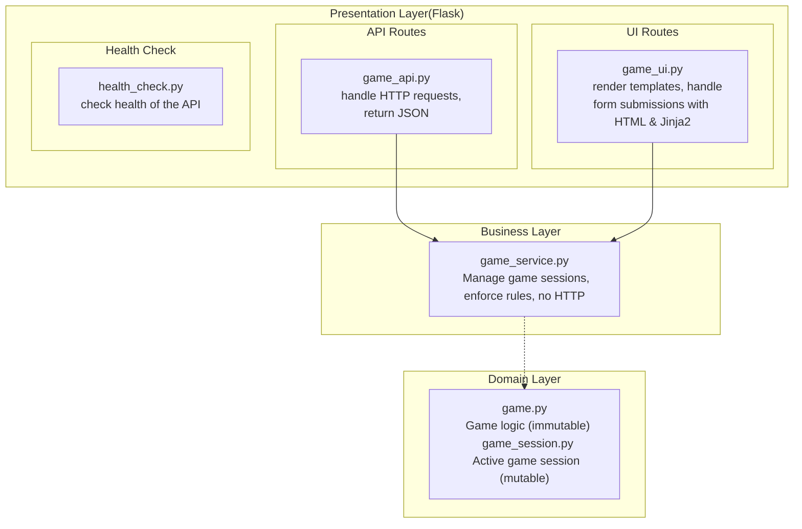

   # Sprint 1 Architecture

   ## System Overview

   GameNight follows a **layered architecture** pattern:

## Design Patterns

1. **App Factory:** The `create_app` function in `game_api.py` creates the Flask app instance with the necessary configuration and routes.
2. **Dependency Injection:** The `game_service.py` module uses dependency injection to inject the `game.py` module into the `GameService` class.
3. **Blueprint:** The `game_api.py` and `game_ui.py` modules use blueprints to register routes and views.
4. **Repository:** (Sprint 2) Data persistence abstraction (e.g., repository pattern)

## Technology Stack

Component | Technology | Version
--------- | ---------- | -------
Backend | Flask | 3.0+
Language | Python | 3.11+
Testing | pytest | 8.0+
Coverage | pytest-cov | 4.0+
CI/CD | GitHub Actions | N/A
Templates | Jinja2 | Included